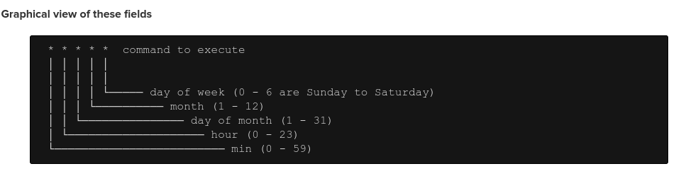

# Setting Up a Cron Job

A cron job is a scheduled task that is executed automatically at specified intervals. To set up a cron job, you'll typically use the `crontab` command in a Linux or Unix-like system.

### Understanding the Crontab Format:

A cron job is defined by five fields, separated by spaces:

1. Minute: 0-59
2. Hour: 0-23
3. Day of Month: 1-31
4. Month: 1-12
5. Day of Week: 0-6 (0 = Sunday)

**Example:**

```sh
0 0 \* \* \* /path/to/your/script.sh
```

This cron job will run your script /path/to/your/script.sh every day at midnight.

### Setting Up a Cron Job:

1. Open Crontab:

```sh
crontab -e
```

> Choose your preferred text editor (e.g., nano, vim).

2. Add a New Job:

Add a new line to your crontab file with the desired schedule and command.

**Example:**

- To run a script every Monday at 3 AM:

```bash
0 3 * * 1 /path/to/your/script.sh
```

- To run a script every 5 minutes:

```sh
*/5 * * * * /path/to/your/script.sh
```

3. Save and Exit: Save the crontab file and exit the editor.

### Additional Tips:

- `Test Your Script`: Ensure your script works correctly before scheduling it.
- `Check Cron Logs`: Use `tail -f /var/log/cron` to monitor cron job output.
- `Use Absolute Paths`: Specify absolute paths to scripts and files to avoid issues.
- `Consider Using a Cron Job Manager`: Tools like crontab or anacron can help manage cron jobs more easily.
- `Security`: Be mindful of permissions and security when running scripts via cron.


**Specifying multiple values**

| Value       | Description                                                                  | Example                                                                                                  |
| ----------- | ---------------------------------------------------------------------------- | -------------------------------------------------------------------------------------------------------- |
| Comma ,     | specifies a list of values                                                   | 1,3,4,7,8                                                                                                |
| Dash -      | specifies a range of values                                                  | 1-6 is equivalent to "1,2,3,4,5,6"                                                                       |
| Asterisk \* | specifies all possible values for a field                                    | An asterisk in the hour (second) field would be equivalent to 'every hour'.                              |
| Slash /     | can be used in conjunction with an asterisk to skip a given number of values | /3 means to skip to every third value. So, \*/3 in the hour field is equivalent to "0,3,6,9,12,15,18,21" |



**Fields**

| Field no. | Description      | Permitted values                         |
| --------- | ---------------- | ---------------------------------------- |
| 1         | minute           | 0-59                                     |
| 2         | hour             | 0-23                                     |
| 3         | day of the month | 1-31                                     |
| 4         | month            | 1-12                                     |
| 5         | day of the week  | 0-7 (both 0 and 7 are considered Sunday) |
